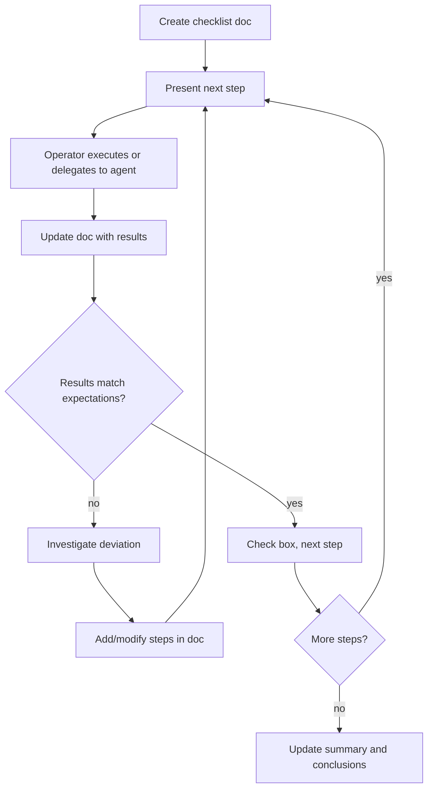

# Interactive Checklist

Step through a multi-step procedure one step at a time, maintaining a
living markdown document that records explicit inputs, actual outputs,
deviations, and conclusions.

## When to Use

- Manual testing of infrastructure or deployment changes
- Migration playbooks and upgrade procedures
- Incident response runbooks
- Any multi-step process where traceability matters
- Tasks involving destructive or irreversible operations

## When NOT to Use

- Fully automated test suites (use TDD instead)
- Simple one-shot tasks with no state to track
- Pure research or exploration (no checklist to maintain)

## Core Pattern

## Creating the Checklist Document

Start by creating a markdown file with this structure:

- **Title and links** — name, ticket links, date
- **Context** — why this procedure exists, what it validates
- **Prerequisites** — tools, access, environment needed
- **Steps** — each with: heading, commands/actions, unchecked expectation boxes
- **Expected outcomes** — summary table, derived from completed steps at the end
- **Notes** — edge cases, gotchas discovered during execution

Each step must have:

1. A numbered/named heading (e.g., `### A3. Wait for provisioning`)
2. Explicit commands or actions (copy-pasteable)
3. Unchecked markdown checkboxes with expected outcomes

**Verify commands from source before writing them.** Do not write API
endpoints, request bodies, or CLI invocations from memory. Trace the
code path to find the actual route definition, Zod schema, or CLI
argument parser. Wrong commands waste time and erode trust in the
checklist. This is especially important for POST/PUT bodies — check
required fields, field names, and validation rules.

**Substitute dynamic values once known.** When a step produces an ID,
password, or other value needed by later steps, update the commands in
subsequent steps with the actual value so they remain copy-pasteable.
Don't leave `<PLACEHOLDER>` in commands after the value is known.

Do not add separate "Actual result:" placeholder sections. Results go
inline with the checkboxes when each step is completed — the checkbox
text is updated to include what actually happened. For example:

Before: `- [ ] Returns version 0.2.0`
After: `- [x] Returns version 0.2.0 — confirmed, also shows shmem_initialized = true`

## Executing Steps

**Present one step at a time.** Don't dump the whole checklist — give the
operator the current step, the command to run, and what to expect.

**The operator decides who executes each step.** Don't assume a step is safe
for the agent to run — the operator has context about the environment,
permissions, and blast radius that the agent may not. Present the command
and wait. If the operator asks the agent to execute it, do so.

**After each step:**

1. Check the box (`- [ ]` → `- [x]`) and append actual findings to the
   same line or as indented continuation lines under the checkbox
2. Do not create separate "Actual result:" sections — keep findings
   co-located with the expectation they validate
3. If the result deviates from expectations, keep the original checkbox
   text and append what actually happened and why on the same line or as
   indented continuation lines
4. **Sweep the rest of the doc for downstream state changes.** A
   completed step can flip state elsewhere. Re-read the whole doc and
   update:
   - Other unchecked boxes whose conditions the just-completed step
     satisfied (e.g., an exit criterion in a later phase)
   - Empty rows in summary/outcomes tables that the step just produced
     data for
   - Forward-looking prose claims that the step contradicts (e.g., "the
     PR awaits merge" once the merge has happened, or "X is active"
     once X has been replaced)

   Skip purely stylistic edits — tense polish on already-complete
   sections, or rewording closed segments for cosmetic consistency, is
   out of scope. The sweep is about factual state that's now wrong, not
   prose that's merely dated.

## Handling Deviations

When reality doesn't match expectations:

1. **Don't just mark it failed and move on.** Investigate.
2. Record the actual output in the doc. For production environments,
   redact credentials and PII; for dev environments, full output is
   usually more useful than redacted output.
3. Determine if the deviation blocks subsequent steps.
4. If it does: add new steps to the doc to work around or investigate.
   Use sub-step numbering (e.g., `B5a`) to keep the original structure
   intact.
5. If it doesn't: note the deviation and continue.
6. Update expectations for downstream steps if the deviation changes
   what to expect.

## Completing the Checklist

When all steps are done:

1. Generate the outcomes/summary table from the completed steps
2. Add a conclusions section if findings differ from initial expectations
3. Ensure every checkbox is checked or has an explanation for why it wasn't
4. The document should be self-contained — someone reading it later should
   understand what was tested, what happened, and what was learned
5. **Verify beyond the test subject.** After the main steps pass, check
   the broader impact — did the operation affect other entities as
   expected? A rollout that patches the test tenant but silently skips
   others is a finding, not a pass.
6. **Capture reusable queries and commands.** If deviations led to useful
   debugging queries (log searches, metrics queries, SQL), add them to
   the notes section. Future runs of the same checklist will hit similar
   issues.

## Common Mistakes

| Mistake                                      | Fix                                                                                                                                                  |
| -------------------------------------------- | ---------------------------------------------------------------------------------------------------------------------------------------------------- |
| Dumping all steps at once                    | Present one step at a time, wait for results                                                                                                         |
| Not recording actual output                  | Always capture what happened, not just pass/fail                                                                                                     |
| Marking deviations as failures and stopping  | Investigate — deviations are findings, not failures                                                                                                  |
| Letting the doc get stale mid-process        | Update after every single step                                                                                                                       |
| Not adapting the plan when reality changes   | Add/modify steps in the doc as you learn                                                                                                             |
| Forgetting to update downstream expectations | A deviation in step 3 may change what step 7 expects                                                                                                 |
| Tunnel-vision on the current step's box      | After each step, sweep the whole doc — downstream checkboxes, summary tables, and forward-looking prose can all flip from a single step's completion |
| Adding "Actual result:" placeholder blocks   | Results go inline with checkboxes, not in separate sections                                                                                          |
| Writing API commands from memory             | Trace the code path first — check route, schema, required fields                                                                                     |
| Leaving placeholders after values are known  | Substitute actual IDs/passwords into subsequent commands                                                                                             |
| Only verifying the test subject              | Check broader impact — did the operation affect all expected entities?                                                                               |
