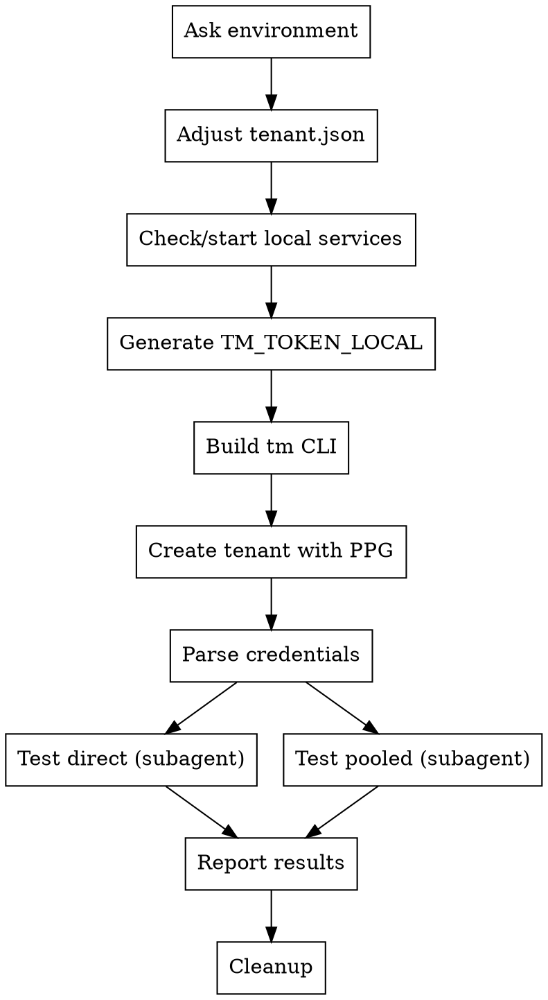

# PPG End-to-End Test

Runs a full end-to-end test of the PPG stack: tenant-manager + ppg-conductor + tcp-proxy + pgbouncer + postgres. Creates a tenant, provisions a database, and exercises it via both direct and pooled psql connections.

## Pre-conditions

- `psql` and `node` installed locally
- Access to the following repos (as sibling directories):
  - `tenant-manager-cli` — Go CLI for tenant operations
  - `pdp-cloudflare` — Cloudflare Workers monorepo (tenant-manager + ppg-conductor)
- `tenant.json` in `tenant-manager-cli/` root (template for tenant creation)

## Workflow



## Step 1: Ask Environment

Ask which dev environment to test against:

- **cdg-dev0** (default)
- **cdg-dev1**

## Step 2: Adjust tenant.json

File: `tenant-manager-cli/tenant.json`

Edit the `ppgConfig.hostname` field based on the chosen environment:

| Environment | hostname                           |
| ----------- | ---------------------------------- |
| cdg-dev0    | `api.cdg-dev0.ppg.prisma-data.net` |
| cdg-dev1    | `api.cdg-dev1.ppg.prisma-data.net` |

Also update `tenantConfig.displayName` to something unique like `e2e-test-<timestamp>` to avoid collisions.

**IMPORTANT:** Read the file first, edit only the hostname and displayName. Do NOT change pgbouncer settings or other fields. Restore the original displayName after the test completes.

## Step 3: Check/Start Local Services

**Automatically check** if services are already running before asking the operator:

```bash
# Check tenant-manager (401 = running, needs auth)
curl -s -o /dev/null -w "%{http_code}" http://localhost:8600/

# Check ppg-conductor (404 = running, RPC-only)
curl -s -o /dev/null -w "%{http_code}" http://localhost:8787/
```

- **Tenant Manager**: HTTP 401 means it's running
- **PPG Conductor**: HTTP 404 means it's running (it's RPC-only, returns "RPC only" on HTTP)

If either is down, start them in the background. The tenant-manager binds to ppg-conductor via service binding (`ppg-conductor-local`), so both must be running. **Start ppg-conductor first.**

### PPG Conductor (Cloudflare Worker, port 8787)

```bash
cd pdp-cloudflare/services/ppg-conductor && pnpm run start
```

Ready when wrangler reports it's listening.

### Tenant Manager (port 8600)

```bash
cd pdp-cloudflare/services/tenant-manager && pnpm run start
```

Wait until `http://localhost:8600` responds (401 is OK).

**NOTE:** If the conductor goes idle (wrangler logs `IoContext timed out due to inactivity`), it may return 500 errors on tenant creation. Restart both services if this happens.

## Step 4: Generate TM_TOKEN_LOCAL

Generate a JWT token by reading `PDP_SHARED_SECRET` from the tenant-manager's `.dev.vars` file and signing an empty payload with HS256.

**IMPORTANT:** The `.dev.vars` file may have multiple `PDP_SHARED_SECRET` lines (some commented). Use the **last uncommented** value. Read the file with Node.js to avoid shell escaping issues with special characters in the secret.

```bash
export TM_TOKEN_LOCAL=$(node -e "
const crypto = require('crypto');
const fs = require('fs');
const devvars = fs.readFileSync('pdp-cloudflare/services/tenant-manager/.dev.vars', 'utf8');
const lines = devvars.split('\n').filter(l => l.match(/^PDP_SHARED_SECRET=/));
const last = lines[lines.length - 1];
const secret = last.split('=')[1].replace(/\"/g, '').trim();
const header = Buffer.from(JSON.stringify({alg:'HS256',typ:'JWT'})).toString('base64url');
const payload = Buffer.from(JSON.stringify({})).toString('base64url');
const sig = crypto.createHmac('sha256', secret).update(header+'.'+payload).digest('base64url');
console.log(header+'.'+payload+'.'+sig);
")
```

**Do NOT use shell variable interpolation** (`$SECRET` in a node -e string) — this breaks when the secret contains special characters. Always read the file directly in Node.js.

Verify: `echo $TM_TOKEN_LOCAL` should output a valid JWT (three dot-separated base64url segments).

## Step 5: Build tm CLI (if needed)

Check if `bin/tm` exists in `tenant-manager-cli/`. Only build if the binary is missing:

```bash
cd tenant-manager-cli && make build
```

## Step 6: Create Tenant with PPG

```bash
cd tenant-manager-cli && cat tenant.json | ./bin/tm tenant create --env local --with-ppg --data - -o json
```

The response is JSON with this structure (relevant fields):

```json
{
  "tenant": { "id": "168feaf6..." },
  "apiKey": { "apiKeySlim": "sk_xxx" }
}
```

**Extract:**

- `TENANT_ID` = `tenant.id`
- `API_KEY_SLIM` = `apiKey.apiKeySlim`

**If creation fails:** Show the full error output and stop. Do NOT proceed with stale credentials.

**Common creation errors:**

- `401 invalid API key signature` — wrong `PDP_SHARED_SECRET` used for token generation
- `500 Internal Server Error` — ppg-conductor likely timed out from inactivity, restart both services

## Step 7: Run Direct and Pooled Tests in Parallel

Launch **two subagents in parallel** — one for direct connections, one for pooled. Both use the same proxy hostname but different usernames. Use separate table names (`e2e_direct` and `e2e_pooled`) to avoid conflicts.

The proxy hostname is the same for both modes:

| Environment | Proxy Host                                  |
| ----------- | ------------------------------------------- |
| cdg-dev0    | `ppg-tcp-proxy.cdg-dev0.db.prisma-data.net` |
| cdg-dev1    | `ppg-tcp-proxy.cdg-dev1.db.prisma-data.net` |

### Subagent 1: Direct Connection

**Prompt the subagent with:**

- Connection host: `ppg-tcp-proxy.<ENV>.db.prisma-data.net`
- Port: `5432`
- Username: `<TENANT_ID>`
- Password: `<API_KEY_SLIM>`
- Table name: `e2e_direct`
- Instructions: Run the SQL test sequence (see below) for 2-3 cycles. Print only PASS/FAIL per operation. On error, print the error message. Drop the table after the last cycle.

### Subagent 2: Pooled Connection

**Prompt the subagent with:**

- Connection host: `ppg-tcp-proxy.<ENV>.db.prisma-data.net`
- Port: `5432`
- Username: `<TENANT_ID>-pool` (append `-pool` suffix to tenant ID)
- Password: `<API_KEY_SLIM>`
- Table name: `e2e_pooled`
- Instructions: Run the SQL test sequence (see below) for 2-3 cycles. Print only PASS/FAIL per operation. On error, print the error message. Drop the table after the last cycle.

**IMPORTANT:** Launch both subagents in a single message (parallel subagent calls). Wait for both to complete before proceeding to the report step.

## SQL Test Sequence

Each subagent uses its own table name (`e2e_direct` or `e2e_pooled`) to avoid conflicts. Replace `<TABLE_NAME>` below with the assigned name.

Run each command as a separate `psql -c "..."` invocation. Run 2-3 full cycles to verify stability. **Suppress normal output** — only print PASS/FAIL per operation. If a command fails, print the error.

**Execution pattern:**

```bash
psql "$CONN" -c "SQL_STATEMENT" > /dev/null 2>&1 && echo "OPERATION: PASS" || echo "OPERATION: FAIL - $(psql "$CONN" -c "SQL_STATEMENT" 2>&1)"
```

**Per cycle:**

```sql
-- 1. Create table
CREATE TABLE IF NOT EXISTS <TABLE_NAME> (
  id SERIAL PRIMARY KEY,
  name TEXT NOT NULL,
  value INT NOT NULL,
  created_at TIMESTAMPTZ DEFAULT NOW()
);

-- 2. Insert records (10+ rows)
INSERT INTO <TABLE_NAME> (name, value) VALUES
  ('alpha', 1), ('bravo', 2), ('charlie', 3),
  ('delta', 4), ('echo', 5), ('foxtrot', 6),
  ('golf', 7), ('hotel', 8), ('india', 9),
  ('juliet', 10);

-- 3. Select and verify count
SELECT COUNT(*) FROM <TABLE_NAME>;

-- 4. Select sample data
SELECT * FROM <TABLE_NAME> ORDER BY id LIMIT 5;

-- 5. Update some records
UPDATE <TABLE_NAME> SET value = value * 10 WHERE value > 5;

-- 6. Verify update
SELECT name, value FROM <TABLE_NAME> WHERE value > 50 ORDER BY name;

-- 7. Delete all records
DELETE FROM <TABLE_NAME>;

-- 8. Verify empty
SELECT COUNT(*) FROM <TABLE_NAME>;
```

After the last cycle, drop the table:

```sql
DROP TABLE IF EXISTS <TABLE_NAME>;
```

**Add a `sleep 2` between cycles** to allow connection pool recycling.

## Step 8: Report Results

Collect results from both subagents and summarize in a table:

- Environment used
- Tenant ID created
- Direct connection (subagent 1): each SQL operation PASS/FAIL
- Pooled connection (subagent 2): each SQL operation PASS/FAIL
- Any errors encountered
- Overall: PASS or FAIL

## Cleanup

Ask the operator whether to delete the tenant. Include the environment and tenant ID in the question. Example:

> "Tenant `<TENANT_ID>` was created in **<ENV>**. Do you want to delete it?"

Options:

- **Yes, delete it** — proceed with deletion
- **No, keep it** — leave the tenant in the dev environment

If the operator chooses to delete, use the tenant-manager API directly (there is no `tm tenant delete` command):

```bash
curl -s -X DELETE "http://localhost:8600/tenants/<TENANT_ID>" \
  -H "Authorization: Bearer $TM_TOKEN_LOCAL"
```

An empty response means success.

Also restore `tenant.json` displayName to its original value.

## Common Failures

| Symptom                              | Likely Cause                                                                           |
| ------------------------------------ | -------------------------------------------------------------------------------------- |
| Token generation: shell syntax error | Secret has special chars — use Node.js file read, not shell interpolation              |
| `tm` fails with "no token found"     | `TM_TOKEN_LOCAL` not exported or generation failed                                     |
| `tm` 401 "invalid API key signature" | Wrong `PDP_SHARED_SECRET` — check `.dev.vars` has multiple lines, use last uncommented |
| `tm` 500 "Internal Server Error"     | ppg-conductor idle/timed out — restart both conductor and tenant-manager               |
| `tm` fails with connection refused   | tenant-manager not running on :8600                                                    |
| psql: connection refused             | tcp-proxy not running in target env                                                    |
| psql: auth failed                    | Wrong tenant_id or api_key_slim extracted                                              |
| psql: SSL error                      | Missing `sslmode=require`                                                              |
| Timeout on first psql                | PgBouncer JIT provisioning in progress, retry after 10s                                |
| Direct works but pooled fails        | ppg-conductor not running or pgbouncer provisioning issue                              |
