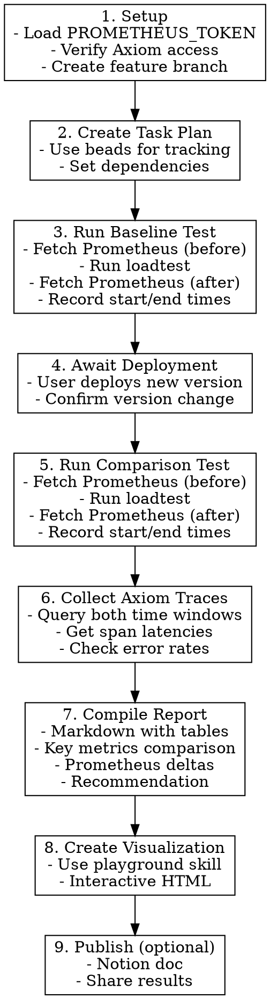

# PPg TCP Proxy A/B Loadtest

## Overview

Structured workflow for comparing two proxy versions using loadtest + Axiom traces, producing a report and visualization.

## Pre-conditions

Before starting, verify:

1. `PROMETHEUS_TOKEN` available (check `.envrc`)
2. Axiom MCP tools accessible (query `otel-traces` dataset)
3. Loadtest configs exist in `tooling/configs/<host>/`
4. Target proxy is reachable

```bash
# Build loadtest binary
make build-loadtest

# Verify proxy health
curl -s "https://ppg-tcp-proxy.<host>.db.prisma-data.net:443/health"
```

## Workflow



## Test Configuration

**Recommended settings to avoid client saturation:**

- Workers: 100-200 max per client machine
- Mode: `churn` (connection cycling) for realistic workload
- Duration: 120 seconds minimum

```bash
# Run loadtest with config
./bin/ppg-loadtest -c tooling/configs/<host>/level2.json \
  --run-id "<label>" \
  -o results/<dir>/<label>.json 2>&1 | tee results/<dir>/<label>.log
```

## Prometheus Metrics Collection

**Capture before and after each test** to measure resource consumption deltas.

```bash
# Fetch metrics snapshot
curl -s -H "Authorization: Bearer $PROMETHEUS_TOKEN" \
  "https://ppg-tcp-proxy.<host>.db.prisma-data.net:443/metrics" \
  > results/<dir>/prometheus-<phase>.txt

# Or use the script
./scripts/fetch-prometheus-metrics.sh <host> > results/<dir>/prometheus-<phase>.txt
```

**Key metrics to track:**

| Category     | Metric                                    | Description                          | Warning Sign                        |
| ------------ | ----------------------------------------- | ------------------------------------ | ----------------------------------- |
| **TCP**      | `tcp_connections_active`                  | Currently active connections         | Should return to baseline           |
| **TCP**      | `tcp_connections_total`                   | Total connections (counter)          | Compare delta between versions      |
| **TCP**      | `tcp_connections_by_state{state="..."}`   | Connections in handshake/idle/active | Stuck in handshake = problem        |
| **TCP**      | `tcp_connection_phase_errors_total`       | Handshake/auth errors                | `slo.impact="true"` errors          |
| **TCP**      | `tcp_execution_phase_errors_total`        | Data streaming errors                | `slo.impact="true"` errors          |
| **Postgres** | `postgres_queries_total`                  | Total queries executed               | Compare throughput                  |
| **Postgres** | `postgres_errors_total`                   | Database errors                      | Should be low                       |
| **System**   | `os_cpu_usage`                            | CPU percentage                       | Sustained high usage                |
| **System**   | `os_memory_usage`                         | Memory percentage                    | Unbounded growth                    |
| **System**   | `process_fd_open`                         | Open file descriptors                | Approaching `process_fd_soft_limit` |
| **Go**       | `process_runtime_go_goroutines`           | Active goroutines                    | Unbounded growth (leak)             |
| **Go**       | `process_runtime_go_mem_heap_alloc_bytes` | Heap allocation                      | Large sustained increase            |

**Calculate deltas** between before/after snapshots to identify resource leaks or abnormal consumption.

**Error classification labels:**

- `error.kind`: `user` (client error), `system` (infrastructure), `invariant` (bug)
- `slo.impact`: `true` if error counts against SLO (system/invariant errors)

## Axiom Queries

### Span Performance by Name

```apl
['otel-traces']
| where ['resource.host.name'] contains "<host>"
| extend duration_ms = ['duration'] / 1000000
| summarize
    total = count(),
    errors = countif(['error'] == true),
    p50_ms = round(percentile(duration_ms, 50), 1),
    p99_ms = round(percentile(duration_ms, 99), 1)
  by ['name']
| order by total desc
```

### Trace Volume Over Time

```apl
['otel-traces']
| where ['resource.host.name'] contains "<host>"
| summarize count() by bin(['_time'], 1m)
| order by ['_time'] asc
```

### Error Breakdown

```apl
['otel-traces']
| where ['resource.host.name'] contains "<host>"
| where ['error'] == true
| summarize count = count() by ['name'], ['status.message']
| order by count desc
```

## Key Metrics to Compare

| Category      | Metrics                                                                             |
| ------------- | ----------------------------------------------------------------------------------- |
| Connections   | Total, Failed, Failure Rate, P50/P99 latency                                        |
| Requests      | Total, Success Rate, Throughput (req/sec)                                           |
| Query Latency | P50, P95, P99, Max                                                                  |
| Axiom Traces  | Volume, Error rate by span                                                          |
| Prometheus    | Goroutines delta, Memory delta, Error counts by kind, Connection state distribution |

## Report Template

```markdown
# A/B Loadtest Report

**Date:** YYYY-MM-DD
**Target:** <host>
**Versions:** <baseline> vs <comparison>

## Executive Summary

[Key findings table with metrics and deltas]

## Test Configuration

[Parameters used]

## Results

[Connection metrics, request metrics, latency]

## Axiom Analysis

[Trace volumes, span performance, errors]

## Prometheus Metrics

[Resource consumption deltas: goroutines, memory, CPU]
[Error counts by kind and SLO impact]
[Connection state distribution during test]

## Conclusion

[Recommendation]
```

## Common Issues

| Issue                     | Cause                 | Solution                    |
| ------------------------- | --------------------- | --------------------------- |
| High conn timeouts (>50%) | Client TLS saturation | Reduce workers to 100-150   |
| No Axiom traces           | Proxy overwhelmed     | Version has severe issues   |
| Inconsistent results      | Insufficient duration | Run for 120s+ minimum       |
| Version not confirmed     | No version endpoint   | Check with user before test |

## Output Artifacts

```
results/<timestamp>-<host>-<label>/
  baseline-<commit>.json              # Raw baseline data
  baseline-<commit>.log               # Console output
  comparison-<commit>.json            # Raw comparison data
  comparison-<commit>.log             # Console output
  prometheus/
    baseline-before.txt               # Prometheus snapshot before baseline test
    baseline-after.txt                # Prometheus snapshot after baseline test
    comparison-before.txt             # Prometheus snapshot before comparison test
    comparison-after.txt              # Prometheus snapshot after comparison test
  REPORT.md                           # Markdown report
  visualization.html                  # Interactive charts
```

## Session Close

After completing the loadtest:

```bash
bd sync                    # Sync beads
git add results/           # Stage results (if tracking)
git commit -m "..."        # Commit
git push                   # Push to remote
```
