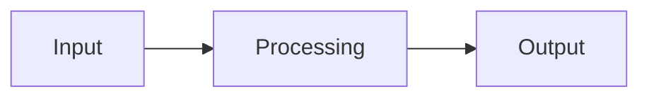

# Architecture

## Intent

Explain how {service} fits together so operators and engineers can
reason about data flow and boundaries without reading the code.

## System overview

<!-- Bullet points: what the service is, what it does at a high level,
     key dependencies it interacts with. -->

## Data flow

<!-- Mermaid flowchart showing how data moves through the system.
     Keep it under 15 nodes. -->

## Responsibilities and boundaries

<!-- For each major component:
     - What it owns (responsibilities)
     - What it does NOT do (boundaries)
     Use bullet points, not code. -->

## Related docs

- [Development](Development.md)
- [Operations](Operations.md)
