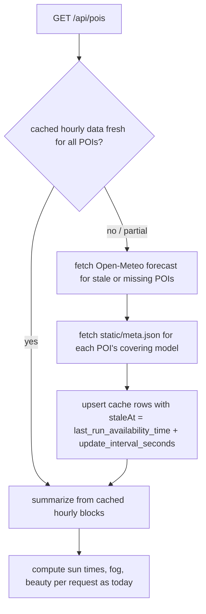

# poi-forecast-cache

## Purpose

Weather forecasts only change when DWD publishes a new ICON model run (~every 3 h for ICON-D2), yet the app re-fetches them from Open-Meteo on every `/api/pois` request. Give POI browsing a fast, provider-friendly read path by fetching each forecast once per model run and serving it from our own database in between.

## At a glance

Today `GET /api/pois` calls Open-Meteo (ICON seamless) on every page load. After this project, the route consults a Postgres-backed forecast cache first and only goes upstream when the cached model run is stale:

**Per-model clocks.** ICON seamless blends three models, each with its own domain and cadence, and each publishing metadata at `https://api.open-meteo.com/data/<model>/static/meta.json` — including its domain bounding box (`crs_wkt` `BBOX`) and `update_interval_seconds`:

| Model | Endpoint slug | Domain BBOX (lat S, lon W, lat N, lon E) | Update interval |
|---|---|---|---|
| ICON-D2 | `dwd_icon_d2` | 43.18, −3.94, 58.08, 20.34 | 3 h |
| ICON-EU | `dwd_icon_eu` | 29.5, −23.5, 70.5, 62.5 | 3 h |
| ICON global | `dwd_icon` | whole globe | 6 h |

Each POI is attributed to its covering model by bounding-box containment in the seamless blend's preference order (D2 → EU → global), and its cache row expires on **that model's** clock. A Berlin POI refreshes every ~3 h on the D2 run; a New York POI only every ~6 h on the global run.

Two research questions settled the design:

1. **Can we learn D2's last and next update time? Yes.** Open-Meteo exposes per-model metadata (see table above), containing `last_run_initialisation_time`, `last_run_availability_time`, `last_run_modification_time` (epoch seconds), and `update_interval_seconds`. Next expected update ≈ `last_run_availability_time + update_interval_seconds`. Two refinements are part of the settled design:
   - **Grace re-check:** availability lags initialisation by ~1.5 h and can slip, so past `staleAt` the app re-checks `meta.json` first; if no new run has landed, `staleAt` extends by a short grace period (~10 min) instead of re-fetching forecasts — neither hammering the API nor stalling forever.
   - **UTC-day rollover invalidation:** the cached window is `forecast_days=2` anchored at fetch time, so crossing UTC midnight is an additional invalidation trigger — this closes the edge where a POI's next sunrise slips past the cached window (at most one extra fetch per day).
2. **Can Prisma Next create unlogged tables? No (v0.14.0).** The Postgres DDL planner hardcodes `CREATE TABLE` with no persistence modifier (`@prisma-next/target-postgres` `planner-ddl-builders.ts`), `PostgresMigration.createTable` accepts only `schema/table/ifNotExists/columns/constraints`, and there is no raw-SQL escape hatch in `migration.ts` (`dataTransform` only accepts typed query-builder DML plans) nor at runtime. **Settled: the cache lives in a regular logged table declared in the Prisma Next contract.** At this scale (a handful of rows rewritten every few hours) the WAL cost is negligible. No upstream feature request will be filed (operator decision).

**What is cached:** the raw per-POI hourly forecast blocks (time, temperature, dew point, cloud cover low/mid/high) as returned by Open-Meteo — never derived values. Sun times, fog probabilities, and beauty flags stay request-time computations because they are anchored to "now" (next sunrise/sunset shifts as time passes even when the underlying forecast doesn't).

**Cache granularity:** one row per POI, so adding a new POI triggers a fetch only for the missing POI (batched with any other stale ones) instead of invalidating everything.

## Non-goals

- **No HTTP/CDN-layer caching of `/api/pois`.** The response is time-anchored (fog targets, next sunrise); only the upstream provider payload is cacheable.
- **No caching of sun-time calculations.** SunCalc is pure CPU and time-dependent; it stays per-request.
- **No unlogged tables and no out-of-band DDL.** Prisma Next 0.14.0 cannot express them (see At a glance §2); we do not hand-run `ALTER TABLE ... SET UNLOGGED` behind the contract's back.
- **No generic caching framework or middleware.** This caches exactly one thing: POI forecast data.
- **No provider or model change.** Open-Meteo ICON seamless stays as-is.
- **No stale-while-revalidate UI, background refresh jobs, or cron.** Refresh happens lazily on request.

## Place in the larger world

- **Open-Meteo forecast API** (`api.open-meteo.com/v1/forecast`, `models=icon_seamless`) — the upstream being shielded; called from `src/services/weather-service.ts`.
- **Open-Meteo per-model metadata** (`api.open-meteo.com/data/<model>/static/meta.json`) — new integration; the cache's TTL clock.
- **Prisma Next 0.14.0** — the cache table is a new model in `src/prisma/contract.prisma`, migrated via the standard contract → emit → migration flow; queried through `db.orm` from `src/prisma/db.ts`.
- **`/api/pois` route** (`src/app/api/pois/route.ts`) — the sole consumer; its response shape must not change.

## Cross-cutting requirements

- **Cache failure degrades to today's behaviour, never worse.** If the cache table is unreachable, empty, or truncated, the route falls back to a direct upstream fetch. Cache rows are disposable; `TRUNCATE` must never break the app.
- **Warm cache masks provider outages.** If Open-Meteo is down but unexpired cached data exists, serve it (today the forecast just disappears).
- **Only provider payloads are persisted, never time-anchored derivations** (fog/beauty/sun times are computed per request from cached raw data).
- **All schema changes flow through the contract and Prisma Next migrations.** No hand-run DDL.

## Transitional-shape constraints

N/A — expected to land as a single slice (cache model + read-through logic in one reviewable change). If split, every intermediate state must keep `/api/pois` fully functional with an empty cache table.

## Project Definition of Done

_Team-DoD floor: `drive/calibration/dod.md` does not exist in this repo yet; no floor to inherit — conditions below are the complete set._

- [ ] Two `GET /api/pois` requests within one model-run window produce exactly one Open-Meteo forecast fetch; the second is served from the cache table (observable via service logs).
- [ ] Once `staleAt` passes, the next request re-fetches, and the cache rows' model-run identity advances.
- [ ] With the cache table truncated, `/api/pois` returns the same response shape and correct forecasts (cold path = current behaviour).
- [ ] Adding a new POI yields a forecast for it on the next request without waiting for other rows to expire.
- [ ] The contract migration applies via the standard Prisma Next flow (`contract emit` → migration) with no manual DDL.
- [ ] `bun run build` (which runs `contract emit`) passes.

## Open Questions

None. The four questions the spec originally shipped with were resolved by the operator (2026-07-10):

1. **Per-model clocks** — operator override of the single-heartbeat working position. Each POI expires on the clock of its covering model, attributed by domain bounding box (see At a glance).
2. **Late-run grace** — working position adopted: re-check `meta.json` past `staleAt`; extend by ~10 min grace when no new run has landed.
3. **UTC-day rollover** — adopted as an additional invalidation trigger.
4. **Unlogged-table feature request** — will not be filed; regular logged table via the Prisma Next contract is the settled shape.

## References

- Linear Project: —
- Open-Meteo DWD ICON docs: https://open-meteo.com/en/docs/dwd-api
- D2 model metadata: https://api.open-meteo.com/data/dwd_icon_d2/static/meta.json
- Code surfaces: `src/services/weather-service.ts`, `src/app/api/pois/route.ts`, `src/prisma/contract.prisma`, `src/prisma/db.ts`
- Unlogged-table evidence: `node_modules/@prisma-next/target-postgres/src/core/migrations/planner-ddl-builders.ts` (hardcoded `CREATE TABLE`), `postgres-migration.ts` (`createTable` options), `data-transform.ts` (no raw SQL)
